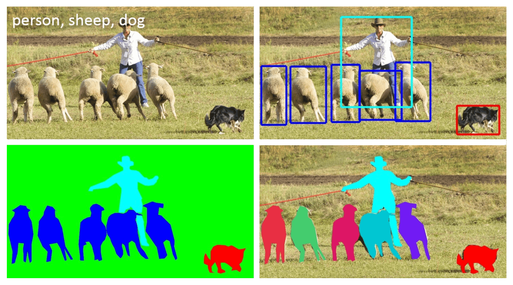

# Background

[Back to README](../README.md)

Before we begin, it's important to understand the problem that we're trying to solve. There are many problems in computer vision, and these can overlap in various ways.

The image below shows several examples:

* **Labelling**: In the top-left, the image is being labelled (or annotated) with the kinds of objects identified.
* **Segmentation**: In the bottom left and right, those objects have been cut out of the image using _Image Segmentation_.
* **Detection**: And in the top-right, we can see bounding boxes drawn around those same objects. This is commonly known as _Object Detection_.

The focus of this exercise is to train an Object Detection model.

## Transfer Learning

Transfer Learning refers to the practice of adapting a pretrained model (typically trained on a large computer vision dataset such as ImageNet or COCO) for a different but related task.

The two main approaches to Transfer Learning are:

* **Feature Extraction**. We freeze the pretrained layers and train a new classifier (or head) for a new task. Freezing a layer means that its weights won't change.
* **Fine-Tuning**. We unfreeze some (or all) of the pretrained layers, allowing the weights to change. Therefore, existing layers will also adapt to the new custom dataset.

There are cases where we might use one approach, or the other.

Feature extraction is well suited to cases where the target task is similar to the original task, or when the target domain is a subset of the original domain.

Fine-Tuning is more effective when the target dataset is large enough or differs significantly from the original domain. In practice, these two approaches are often combined: training begins with pure Feature Extraction, using frozen pretrained weights. Once the model achieves a reasonable level of performance, the pretrained weights are unfrozen, allowing them to adapt to the new task.

## Quantization

One of our goals in converting model weights to RKNN format is to reduce memory overhead through quantization. For example, a model trained with 32-bit floating point (FP32) weights can be quantized to 16-bit floating point (FP16), or even 8-bit integers (INT8), significantly reducing model size and improving inference efficiency on Edge devices.

This process is well described in [A Visual Guide to Quantization](https://newsletter.maartengrootendorst.com/p/a-visual-guide-to-quantization).

## Scaling

Quantization will cause model weights and activations to be scaled, and possibly shifted to a new zero point. These scale and zero point values are chosen (or calibrated) based on a subset of data.

In the case of YOLOv5, we also need to make a small change to the model graph, whereby a post-processing step is moved outside the main model. This is to address stability issues introduced by quantization.
