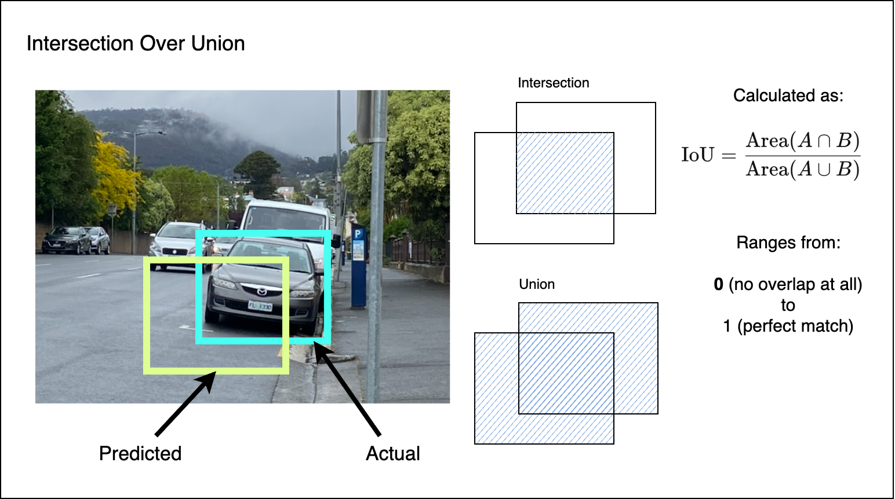

# Evaluation

[Back to README](../README.md)

To evaluate a detector trained on YOLOv5 we want to measure how well the predicted bounding boxes align with the annotated ground truth objects. The most common family of metrics are based on mean Average Precision (mAP). There are two variations of this that we're particularly interested in: **mAP@0.5** (often written as `mAP50`) and **mAP@0.5:0.95** (often written as `mAP50-95`).

Each score captures the average precision of the detector over all classes, but they differ in the Intersection over Union (IoU) thresholds that must be satisfied for a prediction to count as a true positive:

* `mAP50` requires the predicted box to overlap the ground truth with an IoU of at least 0.50.
* `mAP50-95` averages the results across ten IoU thresholds between 0.50 and 0.95 in increments of 0.05.

Together, these values provide a balanced view of recall / precision trade-offs and of how accurately the detector can localize objects. The intuition behind IoU is illustrated below.

## Intersection over Union

IoU is calculated as the ratio of the intersection area between a predicted box and a ground-truth box, to the area of their union. A perfect overlap yields an IoU of 1.0, whereas no overlap produces an IoU of 0.0. Because IoU captures localization quality, increasing the IoU threshold forces the detector to align boxes more precisely in order to maintain high precision scores.

In addition to mAP, it is useful to inspect class-wise _precision_ and _recall_. Precision highlights how often predicted boxes are correct, recall reflects the fraction of ground-truth objects that were detected. We can also inspect the [confusion matrix](https://en.wikipedia.org/wiki/Confusion_matrix), which reveals systematic misclassifications between classes.

Together with mAP, these metrics help determine whether you should gather more data, adjust augmentation strategies, or refine anchor settings before deploying the model.

## Interpretation

The `mAP50` and `mAP50-95` scores reported at the end of training give us a snapshot of how well the detector generalizes to unseen data. For the Apples vs Oranges dataset the `mAP50` values are relatively low (close to 0.5), which suggests that the model will struggle to perform well on unseen data.

There are many reasons this can occur. The most likely in this case are insufficient training data, poor labels, or lack of training time.
